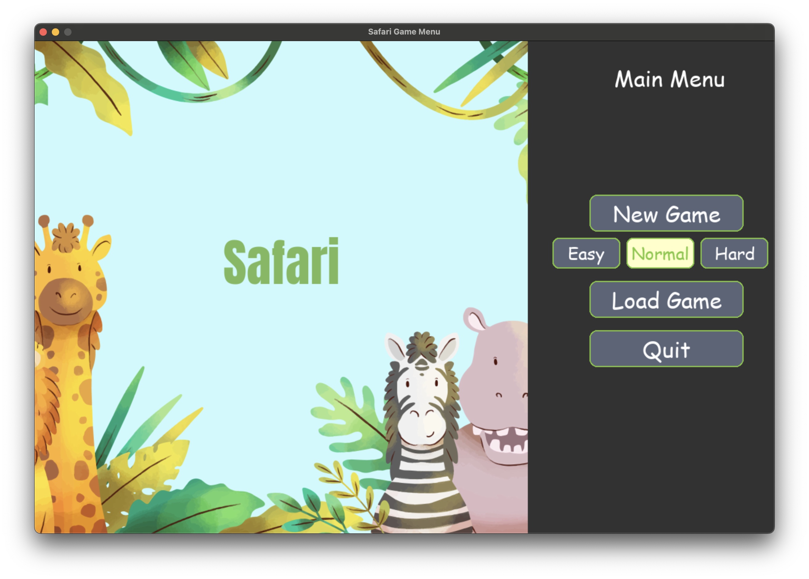
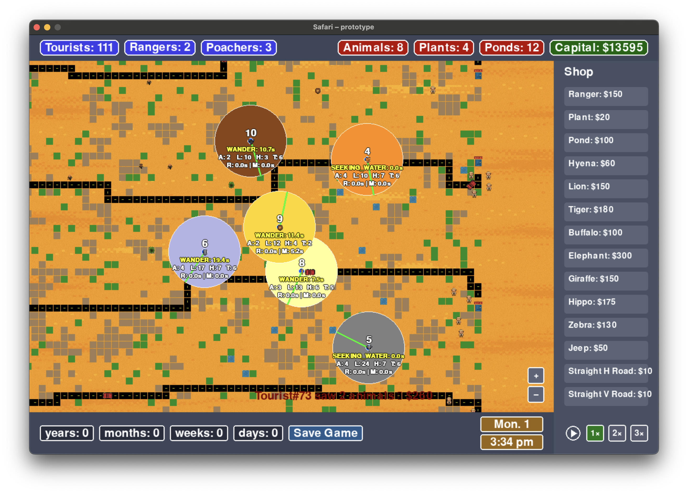
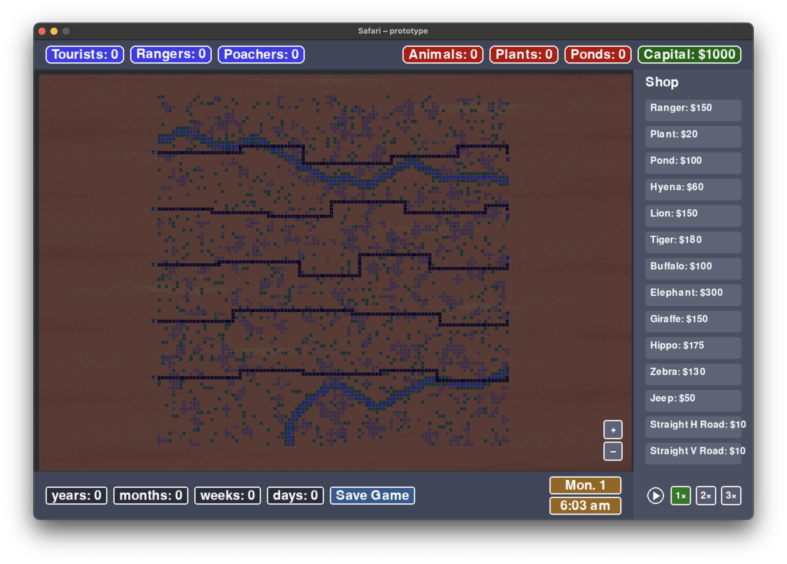

# Safari Project

## Table of Contents
1. [Overview](#overview)
2. [Prerequisites](#prerequisites)
3. [Installation](#installation)
4. [Activating the Environment](#activating-the-environment)
5. [Running the Game](#running-the-game)

---

## About
This project simulates an **African Safari** environment where players can manage animals, tourists, jeeps, and more using Python and Pygame.

## Preview

  
  

  
  

## Prerequisites
- **Python 3.10+** installed on your machine  
- **Poetry** (2.x or later)  
- **Git** for version control (optional if you just want to run locally)

## Installation
1. **Clone the Repository**:  
   `git clone <REPO_URL>`  
   `cd <PROJECT_FOLDER_NAME>`  
2. **Install Dependencies with Poetry**:  
   `poetry install`

## Activating the Environment
- If using **Poetry 2.x**:  
  `poetry env activate`  
- If that doesn’t work, find the venv path:  
  `poetry env info --path`  
  then  
  `source <PATH_TO_VENV>/Scripts/activate`  
- If you installed the **Shell Plugin**:  
  `poetry self add poetry-plugin-shell`  
  `poetry shell`

## Running the Game
After activating the environment, run:  
`python src/main.py`  
If you have a script defined in your `pyproject.toml`, for example:  
[tool.poetry.scripts] my-safari-game = "src.main:run_game"
then you can do:  
`poetry run python3 src/my_safari_project/main.py`

## Link to Full Project
https://szofttech.inf.elte.hu/software-technology-2025/group-02/binary-brains
